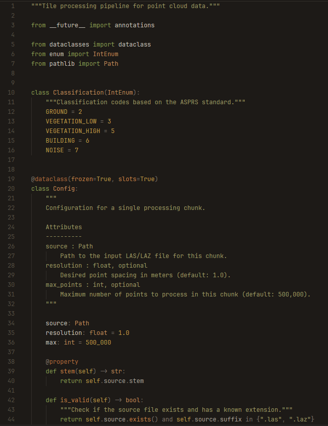
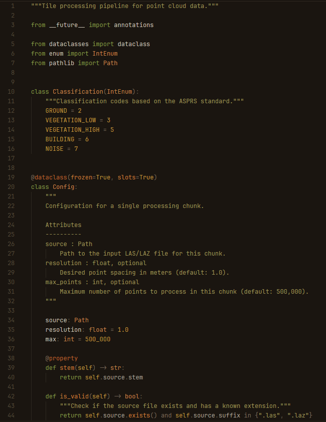
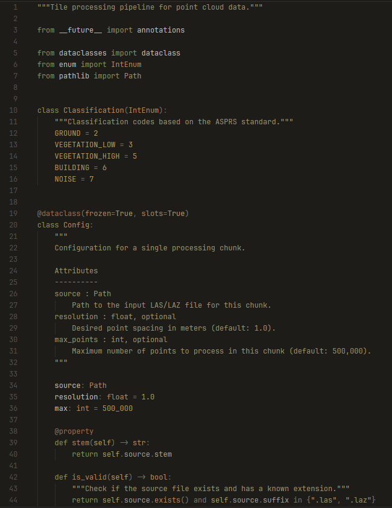

# Hick's Hexagon

A warm, earth-toned dark theme for [Zed](https://zed.dev) inspired by the iconic Hick's Hexagon carpet pattern from Stanley Kubrick's *The Shining*.

No cool tones. No neon. No purple. Just burnt orange, olive, mustard, rust, and sandstone on a dark walnut background. Colors that feel like a warm room, not a control panel.

## Variants

### Hearth

### Ember

### Ash

## Installation

Open the command palette in Zed and search for `zed: extensions`. Search for "Hick's Hexagon" and install.

Then open the theme selector (`cmd-k cmd-t` / `ctrl-k ctrl-t`) and pick your variant.

## Local installation

Copy `themes/hicks-hexagon.json` to `~/.config/zed/themes/` and restart Zed.

## Color philosophy

Every syntax color lives in the orange-yellow-olive wedge of the color wheel. The palette draws from 1970s earth tones: avocado appliance green for keywords, burnt orange for functions, copper and rust for decorators, mustard gold for numbers and constants, sandstone for types, and warm khaki for strings. The foreground is a bright parchment white that reads cleanly without competing with the accent colors.

## License

MIT
